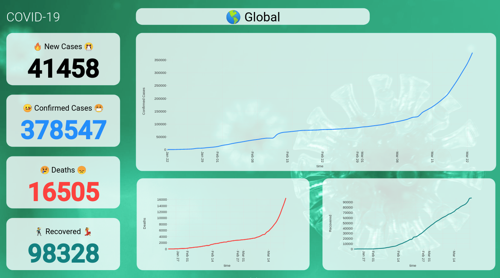
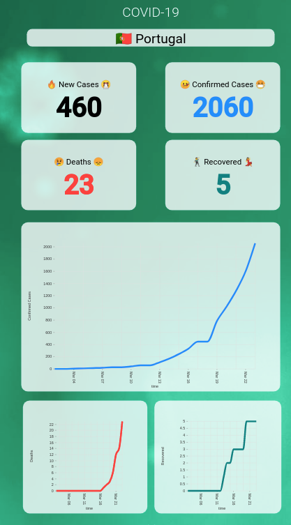

# COVID-19 Panel for Digital Signage

This project renders a DigitalSignage-ready Panel with COVID-19 data. The panel is responvive (works from 360p to 4k resolutions) and fullscreen without scrolling.

## How to Use

Just copy & paste the panel URL into your Digital Signage software, or even in a web browser.

> If you don't have a Digital Signage software, consider using [DSPLAY - Digital Signage](https://dsplay.tv)

### Local Panel (Auto detect user country)

For auto-detecting your country and showing local panel just use:

https://covid19.dsplay.tv

### Global Panel

For showing Global panel just use:

https://covid19.dsplay.tv?countries=Global

### Country/Place specific Panel

For showing country-specific panel, visit the link below and follow the instructions:

https://covid19.dsplay.tv/setup

it will give you a URL like the following (ex: a panel for Global, China and Portugal):

https://covid19.dsplay.tv?countries=Global%2CChina%2CPortugal&duration=15

## References

This project uses data from https://github.com/pomber/covid19

This project was bootstrapped with [Create React App](https://github.com/facebook/create-react-app).

## Build status

